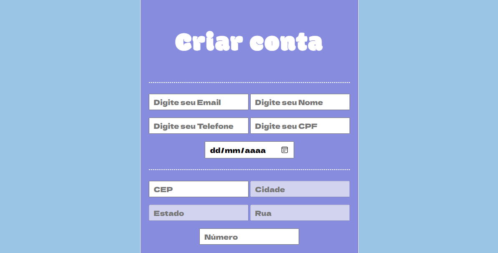

# Índice
[Introdução](#introdu%C3%A7%C3%A3o)  
[Descrição de Funcionalidades](#descri%C3%A7%C3%A3o-de-funcionalidades)  
[Teclonogias](#tecnologias)  
[Autor](#autor)

# Projeto de cadastro com informações mais completas.

Projeto feito para complementar as informações do projeto anterior, focando nas informações que faltaram durante a escrita para o endereço.

### Segunda parte

# Introdução: 

Esse novo projeto foi criado para a correção do anterior com falta de informações de endereço, tal que foi corrigido, e o cadastro pode ser feito com maior precisão. Contendo área aberta para todos os gêneros e um opcional de complemento na área de endereço. Além da falta de README/incompleto, sem explicação completas e imagens do atual site presentes..

Ativ nova: correção com o DDD do celular, e cep preenche automaticamente os campos de endereço.

# Descrição de Funcionalidades:
Sistema para:
* Cadastrar usuários novos.
* Contém novas informações de: gênero, cep, cidade, estado, número e bairro.
* Auto-complete de informações como: Cidade, Rua, Estado pelo CEP.
* Adicionar Implementação do padrão de telefone.
* Adicionado: DDD de telefone e cep para preenchimento dos campos de endereço.

Assim como feito apartir do projeto anterior, essa correção serve para basicamente para cadastrar novos usuários em uma plataforma qualquer, contendo informações completas para que isso seja concluído da melhor forma. 

# Notificações:
* Caso cadastro incorreto:  

* Caso cadastro correto:  

# Tecnologias:
* JavaScript;
* CSS 3;
* HTML 5;
* Google Fonts;
* GIT, GITHUB;
* README.

# **Inspirações de e-comerce:**
- Americanas (Campos)
- eBay (Padrão de Telefone)
- Alibaba (Auto Completar o Cep)
- Etsy (Campos)

# **Alguns links:**
* [Alura -  Como escrever um README](https://www.alura.com.br/artigos/escrever-bom-readme)
* [Via CEP - Consulte CEP](https://viacep.com.br/)

| Novas Implementações |
| -------------------- |
| Auto Completar o endereço |
| Adicionar Padrão de telefone |
| Remover Campo **"Bairro"** | 

# Autor
## projeto por- [@Layla Beatrice](https://www.github.com/laylabtrice)

# Auxilio
## projeto por- [@Vitor Gabriel](https://www.github.com/vitorgabrieldev)