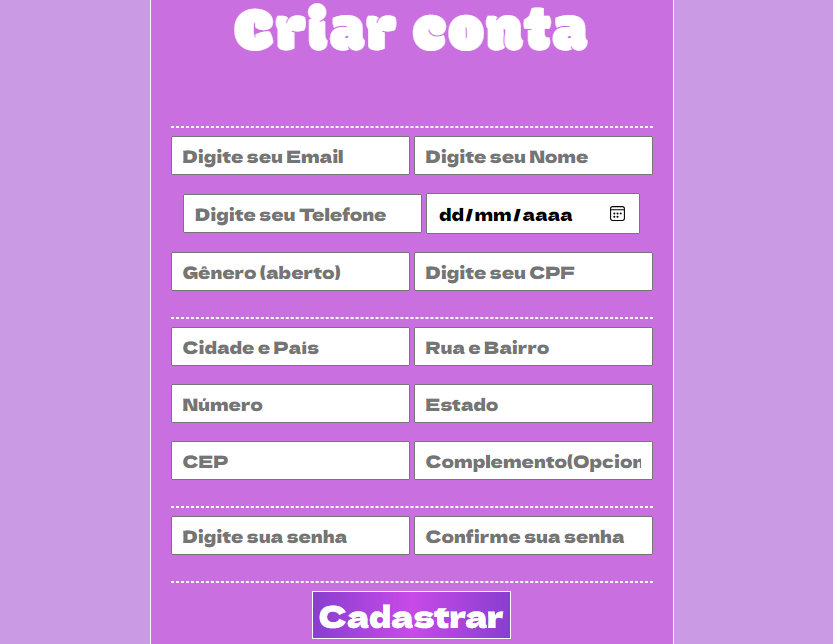

# Índice
[Introdução](#introdu%C3%A7%C3%A3o) 
[Descrição de Funcionalidades](#descri%C3%A7%C3%A3o-de-funcionalidades) 
[Teclonogias](#tecnologias) 

# Projeto de cadastro com informações mais completas.

Projeto feito para complementar as informações do projeto anterior, focando nas informações que faltaram durante a escrita para o endereço.

# Introdução: 

Esse novo projeto foi criado para a correção do anterior com falta de informações de endereço, tal que foi corrigido, e o cadastro pode ser feito com maior precisão. Contendo área aberta para todos os gêneros e um opcional de complemento na área de endereço. Além da falta de README/incompleto, sem explicação completas e imagens do atual site presentes..

# Descrição de Funcionalidades:
Sistema para:
* Cadastrar usuários novos.
* Contém novas informações de: gênero, cep, cidade, estado, número e bairro.

Assim como feito apartir do projeto anterior, essa correção serve para basicamente para cadastrar novos usuários em uma plataforma qualquer, contendo informações completas para que isso seja concluído da melhor forma. 

# Tecnologias:
* JavaScript;
* CSS;
* HTML;
* Google Fonts;
* GIT, GITHUB;
* README...

## Autor do projeto- [@Layla Beatrice](https://www.github.com/laylabtrice) 

